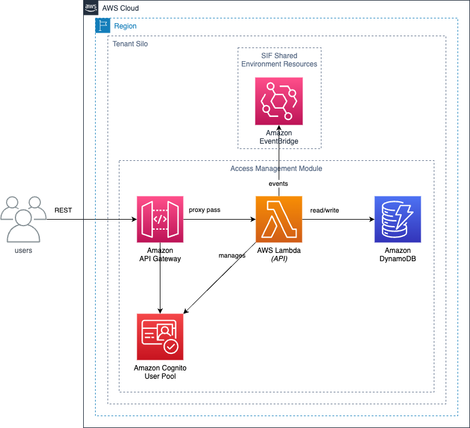

# Design

## Overview

The AWS Sustainability Insights Framework (SIF) is a modular system built atop AWS services, facilitating building sustainability-related use cases. Developers can integrate these modules into their applications for seamless functionality.

## High Level Architecture

SIF is structured as layers of modules over AWS services. Each module targets specific features, and they interact as depicted in the provided diagrams. Users interact with these modules primarily through REST APIs. Notably, the Calculator module is an exception, as it's internally invoked by other modules.

The following conceptual architecture shows these modules and their interactions:

Users of SIF interact with these modules through REST APIs. Access Management, Impacts, Reference Datasets, Pipelines, and Pipeline Processors all present REST APIs. The Calculator module does not present an API to external users and instead is invoked by the other modules.

SIF is designed to support multi-tenant deployments. Separate tenants of SIF can be deployed per AWS region and per environment (development, test, prod). In a multi-tenant deployment a separate set of infrastructure is deployed for each tenant in each environment.

## Module Architecture

The following architecture diagrams show the AWS architecture of the individual modules:

### Access Management

The Access Management module allows for permissions management and segregation of resources within SIF through the concept of users and groups. An external REST API is provided for SIF users to define users and groups. Internally the other SIF modules make calls to Access Management to validate permissions.

**Runtime Architecture**

Users of SIF interact with the Access Management module through an externally available API. This API consists of a REST API in Amazon API Gateway with the application logic running as a "fat Lambda" application deployed in AWS Lambda. User authentication is done through tokens received from Amazon Cognito. Access Management data is stored in a table in Amazon DynamoDB. Events are emitted to a message bus in Amazon EventBridge on Access Management resource changes. Each tenant has their own copy of the Access Management infrastructure.

**Deployment Time Architecture**

Deployment of the Access Management infrastructure is deployed per-tenant in an AWS region. Deployment is done through CloudFormation, handled by the AWS Cloud Development Kit. The deployment:

* Creates the infrastructure for the Access Management module
* Stores configuration in the AWS Systems Manager Parameter Store
* Seeds bootstrap data in Amazon DynamoDB
* Sets up log retention policies for application logs

### Impacts

The Impacts module enables users to manage impact related resources such as impact factors which can be referenced from within Calculations and Pipelines when performing data processing calculations such as emissions. An example Impact could be the carbon dioxide equivalent (CO2e) of a specific activity such as mobile diesel fuel consumption. The Impacts module has the capability to create many Impact resources in bulk through an Impact Tasks API. Impacts are versioned to provide traceability.

**Runtime Architecture**

Users of SIF interact with the Impacts module through an externally available API. This API consists of a REST API in Amazon API Gateway with the application logic running as a "fat Lambda" application deployed in AWS Lambda. User authentication is done through tokens received from Amazon Cognito and authorization is done through the Access Management module. Impact data is stored in a table in Amazon DynamoDB. Amazon Simple Queue Service is used along with an Impact task processor Lambda to orchestrate bulk Impact creation tasks. SQS is also used to asynchronously process metadata updates to resources such as adding searchable tags. Events are emitted to a message bus in Amazon EventBridge on Impact resource changes. Each tenant has their own copy of the Impacts module infrastructure.

**Deployment Time Architecture**

Deployment of the Impacts module infrastructure is deployed per-tenant in an AWS region. Deployment is done through CloudFormation, handled by the AWS Cloud Development Kit. The deployment:

* Creates the infrastructure for the Impacts module
* Stores configuration in the AWS Systems Manager Parameter Store
* Sets up log retention policies for application logs

### Reference Datasets

The Reference Datasets module enables users to manage datasets such as lookup tables which can be referenced from within Calculations and Pipelines when performing data processing calculations such as emissions. An example Reference Dataset could be a table that enables lookup of the mix of electricity generation (coal, nuclear, wind, etc.) for a particular location. Reference Datasets are versioned to provide traceability.

**Runtime Architecture**

Users of SIF interact with the Reference Datasets module through an externally available API and file uploads to S3 via pre-signed URL. The REST API consists of a REST API in Amazon API Gateway with the application logic running as a "fat Lambda" application deployed in AWS Lambda. User authentication is done through tokens received from Amazon Cognito and authorization is done through the Access Management module. Reference Dataset data is stored in a split between Amazon DynamoDB and Amazon S3. Data such as dataset names and metadata such as tags is stored in DynamoDB. The actual dataset is stored in S3. To enable searches for lookups, the dataset is indexed when created or updated. This indexing is done in a Lambda function triggered by EventBridge events from S3 object updates. After the dataset is indexed, the index data is stored in S3. Amazon Simple Queue Service is used to asynchronously process metadata updates to resources such as adding searchable tags. Events are emitted to a message bus in Amazon EventBridge on Dataset resource changes. Each tenant has their own copy of the Reference Datasets module infrastructure.

**Deployment Time Architecture**

Deployment of the Reference Datasets module infrastructure is deployed per-tenant in an AWS region. Deployment is done through CloudFormation, handled by the AWS Cloud Development Kit. The deployment includes deploying the Reference Datasets REST API as well as the Reference Datasets Indexer. Both deployments:

* Create the infrastructure for the Reference Datasets module
* Stores configuration in the AWS Systems Manager Parameter Store
* Sets up log retention policies for application logs

### Calculations

The Calculations module enables users to define and manage equations or functions which can then be referenced in other Calculations or Pipelines when performing data processing calculations such as emissions. Example calculations could be simple such as unit conversions or complex such as the agreed upon calculation for emissions by the business. Calculations are versioned to provide traceability.

**Runtime Architecture**

Users of SIF interact with the Calculations module through an externally available API. This API consists of a REST API in Amazon API Gateway with the application logic running as a "fat Lambda" application deployed in AWS Lambda. User authentication is done through tokens received from Amazon Cognito and authorization is done through the Access Management module. Calculations data is stored in a table in Amazon DynamoDB. Amazon Simple Queue Service is used to asynchronously process metadata updates to resources such as adding searchable tags. Events are emitted to a message bus in Amazon EventBridge on Calculations resource changes. Each tenant has their own copy of the Calculations module infrastructure.

**Deployment Time Architecture**

Deployment of the Calculations module infrastructure is deployed per-tenant in an AWS region. Deployment is done through CloudFormation, handled by the AWS Cloud Development Kit. The deployment:

* Creates the infrastructure for the Calculations module
* Stores configuration in the AWS Systems Manager Parameter Store
* Sets up log retention policies for application logs

### Pipelines

The Pipelines module enables users to manage Pipeline configurations which define data processing pipelines used to perform calculations such as emissions. A Pipeline can be configured to aggregate outputs across executions and groups into Metrics which capture KPIs such as total emissions over time. A user can request a dry run of a Pipeline configuration to have the configuration processed by the Calculator to check for errors and validate before creation. Pipeline configurations are versioned to provide traceability.

**Runtime Architecture**

Users of SIF interact with the Pipelines module through an externally available API. This API consists of a REST API in Amazon API Gateway with the application logic running as a "fat Lambda" application deployed in AWS Lambda. User authentication is done through tokens received from Amazon Cognito and authorization is done through the Access Management module. Pipeline configuration is stored in a table in Amazon DynamoDB. The Pipelines module can directly invoke the Calculator module to dry run a pipeline configuration. Amazon Simple Queue Service is used to asynchronously process metadata updates to resources such as adding searchable tags. Events are emitted to a message bus in Amazon EventBridge on Pipeline resource changes. Each tenant has their own copy of the Pipelines module infrastructure.

**Deployment Time Architecture**

Deployment of the Pipelines module infrastructure is deployed per-tenant in an AWS region. Deployment is done through CloudFormation, handled by the AWS Cloud Development Kit. The deployment:

* Creates the infrastructure for the Pipelines module
* Stores configuration in the AWS Systems Manager Parameter Store
* Sets up log retention policies for application logs

### Pipeline Processors

The Pipeline Processors module is responsible for the orchestration of Pipelines. This includes starting a pipeline execution in response to input files provided by a user and performing any aggregations defined in the pipeline configuration. The Pipeline Processors module also provides status of pipeline executions.

**Runtime Architecture**

Users of SIF interact with the Pipeline Processor module through an externally available API. This API consists of a REST API in Amazon API Gateway with the application logic running as a "fat Lambda" application deployed in AWS Lambda. User authentication is done through tokens received from Amazon Cognito and authorization is done through the Access Management module. The REST API allows a user to query the execution status of a pipeline, query for activities processed by a pipeline, as well as query for metrics aggregated from activities. Activity data processed by a pipeline is stored in a Amazon Athena Serverless V2 database. Metrics data processed by a pipeline are stored in an Amazon DynamoDB database. Orchestration of Pipelines execution is done through tasks defined in an AWS Step Function. The Step Function verifies a pipeline configuration and input data, performs calculations defined in the pipeline by invoking the Calculator, performs aggregations defined in the pipeline configuration on Calculator outputs, stores aggregations as metrics, and records the status of the execution.

**Deployment Time Architecture**

Deployment of the Pipeline Processor module infrastructure is deployed per-tenant in an AWS region. Deployment is done through CloudFormation, handled by the AWS Cloud Development Kit. The deployment:

* Creates the infrastructure for the Pipeline Processor module
* Stores configuration in the AWS Systems Manager Parameter Store
* Sets up log retention policies for application logs

### Calculator

The Calculator is a backend component which parses and executes the operations defined within a pipeline. This can include arithmetic operations or lookups of resources such as Reference Datasets and Impacts. The Calculator also captures an audit log of all operations performed in the pipeline such as input values and the version of each resource (Reference Datasets, Impacts, Calculations) used in that execution.

**Runtime Architecture**

The Calculator module is invoked through an AWS Step Function defined in the Pipeline Processors module. The Calculator uses the Pipeline configuration to execute all of the operations in the configuration. These operations may be lookups in Reference Datasets, retrieving Impacts, or retrieving functions defined in the Calculations module. This is done by invoking the API Lambdas for each module. Outputs for each activity processed as part of a pipeline are written to the activity data in an Amazon Aurora V2 Serverless database. Audit logs are written to an output location in Amazon S3 through writes to an Amazon Kinesis Data Firehose.

**Deployment Time Architecture**

Deployment of the Calculator module infrastructure is deployed per-tenant in an AWS region. Deployment is done through CloudFormation, handled by the AWS Cloud Development Kit. The deployment:

* Creates the infrastructure for the Calculator module
* Stores configuration in the AWS Systems Manager Parameter Store
* Sets up log retention policies for application logs

