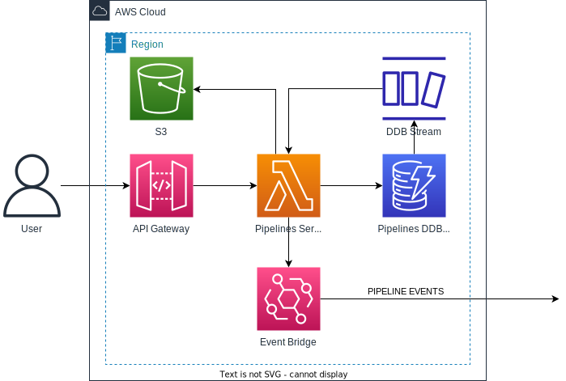

# High level Architecture



# Data Layer Design

Pipeline Module utilizes 2 different types of data stores.
- dynamodb (for metadata)
- s3 (for files)

DynamoDB
Single table pattern with GSI overloading.

Keys and access patterns defined as follows:

## DynamoDB Design

Single table pattern with GSI overloading.
Keys and access patterns defined as follows:

### Table Structure

#### Key Prefixes for Pipeline Entity

- `P`: pipeline
- `PV`: pipeline version
- `PE`: pipeline Execution
- `G`: Group Membership
- `T`: Tag
- `TA`: Tag aggregation

### Table Schema

#### Base Table
| description       | pk                 | sk                         | siKey1           |
|-------------------|--------------------|----------------------------|------------------|
| pipeline          | `P:<pipelineId>`   | `PV:latest`                | `P`              |
| pipelineVersion   | `P:<pipelineId>`   | `PV:<versionNo>`           | `P`              |
| pipelineExecution | `PE:<executionId>` | `PE:P`                     | `P:<pipelineId>` |
| group membership  | `P:<pipelineId>`   | `G:<groupId>`              | `G:<groupId>`    |
| tag               | `T:<key>`          | `T:<value>:P:<pipelineId>` |                  |
| tag aggregate     | `TA:<key>`         | `TA:<value>`               | `TD`             |

#### GSI-1
| description       | pk:`siKey1`      | sk:`pk`             |
|:------------------|:-----------------|:--------------------|
| pipeline          | `P`              | `P:<pipelineId>`    |
| pipelineVersion   | `P:<pipelineId>` | `PV:<versionNo>`    |
| pipelineExecution | `P:<pipelineId>` | `PE:<executionId>`  |
| group membership  | `G:<groupId>`    | `P:<pipelineId>`    |
| tag aggregate     | `TD`             | `TA:<key>`          |

#### Attributes

| attribute   | example                                                           | description |
|-------------|-------------------------------------------------------------------|-------------|
| pk          | P: C:03d66e78-5eac-4781-aede-e1bed34d1e81                         |             |
| sk          | PV:latest                                                         |             |
| siKey1      | P                                                                 |             |
| name        | sap:emissions:pipeline                                            |             |
| state       | enabled                                                           |             |
| createdAt   | 2022-08-10T23:55:20.322Z                                          |             |
| updatedAt   | 2022-08-10T23:55:20.322Z                                          |             |
| createdBy   | abc@xyz.com                                                       |             |
| updatedBy   | abc@xyz.com                                                       |             |
| version     | 1                                                                 |             |
| attributes  | {"label": "My Pipeline", "description": "this is a new pipeline"} |             |
| tags        | [{key: 'source',value: 'sap'}, {key: 'plant',value: 'abc'}]       |             |
| transformer | Refer to transformer object example below                         |             |
| groups      | ['/usa/northwest']                                                |             |

**Transformer Attribute**
```json
// example transformer object
{
  "transforms": [{
    "index": 0,
    "formula": "LOOKUP('vehicle_type', IN(:pin24))",
    "outputs": [{
      "index": 0,
      "key": "vehicle",
      "label": "Vehicle",
      "description": "some description about pin24",
      "type": "number"
    }]
  }],
  "parameters": [{
    "index": 0,
    "key": "pin24",
    "label": "pin 24",
    "description": "some description about pin24",
    "type": "string"
  }]
}
```

### Access Patterns & Queries

| Access pattern                     | Query                                                                                                                                                                                                                                                                                                                                                                                                                                                                                                                                           |
|:-----------------------------------|:------------------------------------------------------------------------------------------------------------------------------------------------------------------------------------------------------------------------------------------------------------------------------------------------------------------------------------------------------------------------------------------------------------------------------------------------------------------------------------------------------------------------------------------------|
| create a new pipeline              | `PUT TABLE:`<br/>`pk='P:<pipelineId>', sk='PV:current', siKey1='P'`<br/>`pk='P:<pipelineId>', sk='PV:<version>'`<br/>`for each non hierarchical tag (no '/'): pk='T:<key>', sk:'T:<value>:P:<pipelineId>'`<br/>`for each hierarchical tag (contains '/'), for each level: pk='T:<key>#<parent>', sk:'T:<value>:P:<pipelineId>'`                                                                                                                                                                                                                 |
| update an existing pipeline        | `create a new pipeline` + <br/> `DELETE TABLE:`<br/> `for each non hierarchical tag removal (no '/'): pk='T:<key>', sk:'T:<value>:<id>'`<br/>`for each hierarchical tag removal (contains '/'), for each level: pk='T:<key>#<parent>', sk:'T:<value>:<id>'`                                                                                                                                                                                                                                                                                     |
| get an existing pipeline           | `TABLE: pk='P:<pipelineId>', sk='PV:current'`                                                                                                                                                                                                                                                                                                                                                                                                                                                                                                   |
| list pipelines                     | `GSI-1: siKey1='P', paginate with <id>`                                                                                                                                                                                                                                                                                                                                                                                                                                                                                                         |
| get a specific pipeline version    | `TABLE: pk='P:<pipelineId>', sk='PV:<version>'`                                                                                                                                                                                                                                                                                                                                                                                                                                                                                                 |
| list existing pipeline versions    | `GSI-1: siKey1='P:<pipelineId>', begins_with('sk', 'PV:')`                                                                                                                                                                                                                                                                                                                                                                                                                                                                                      |
| list pipeline executions           | `GSI-1: siKey1='P:<pipelineId>', begins_with('sk', 'PE:')`                                                                                                                                                                                                                                                                                                                                                                                                                                                                                      |
| get a specific pipeline execution  | `TABLE: pk='PE:<executionId>', sk='PE:P'`                                                                                                                                                                                                                                                                                                                                                                                                                                                                                                       |
| list tags                          | `GSI-1: siKey1="TA", paginate with <key>`                                                                                                                                                                                                                                                                                                                                                                                                                                                                                                       |
| list pipelines by tags             | `Step 1: For each requested tag (an AND query), perform parallel query execution of:- pk='T:<key>" (or 'T:<key>#<parent>' if hierarchical), sk='T:<value>'`<br/>`Step 2: At application layer, process the tag query responses looking for a match across all. <br/>If matched, add <id> to list. If a tag query response is empty get next page.<br/> If reached total <id> requested or no more results for a particular tag query response proceed to next step.`<br/>`Step 3: Batch get of <ids> to build the page of reference datasets.`  |


## S3 Design

### Data Access Patterns (S3)
- generate a presigned url for input upload data file
- generate a presigned url for execution output download data file

### Partition Key

| Access Pattern                                      | Partition Key                                                                             |
|-----------------------------------------------------|-------------------------------------------------------------------------------------------|
| pipeline input data file                            | `<bucket>/pipelines/{pipelineId}/{version}/ingest/{pipelineId}-{version}-{timestamp}.txt` |
| pipeline input data file copied to pair with output | `<bucket>/pipelines/{id}/{version}/exections/{id}/input.txt`                              |
| pipeline execution output data file                 | `<bucket>/pipelines/{id}/{version}/exections/{id}/output.txt`                             |


