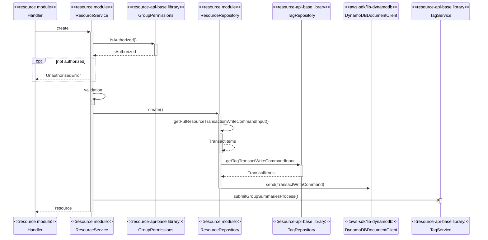
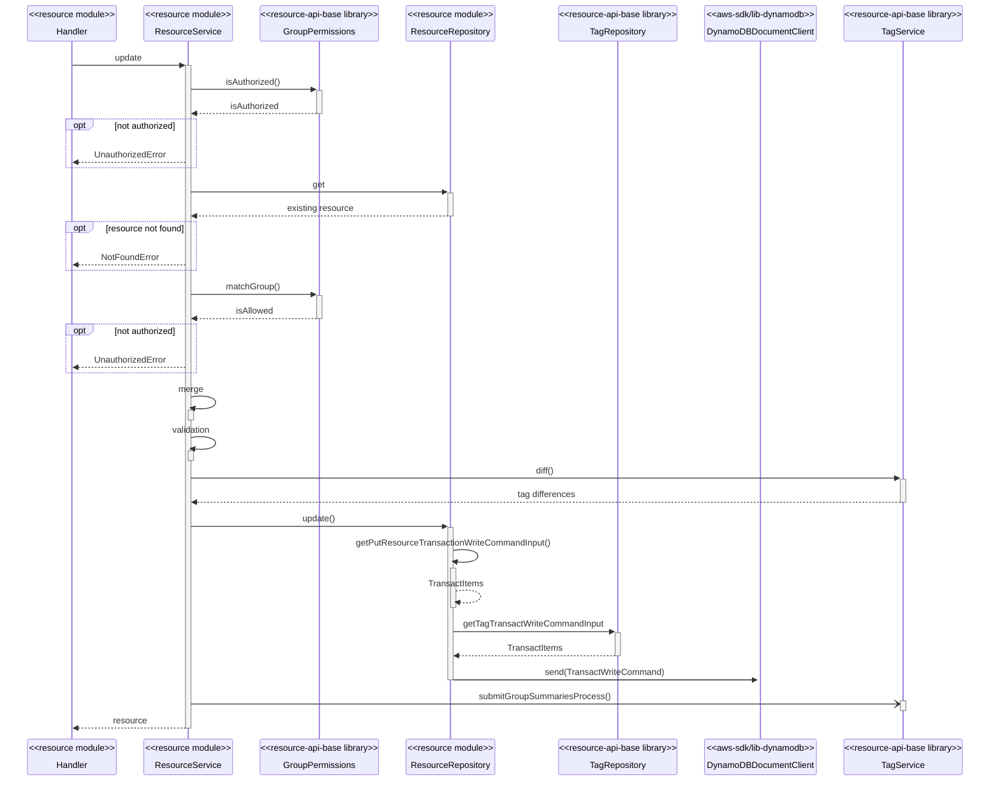
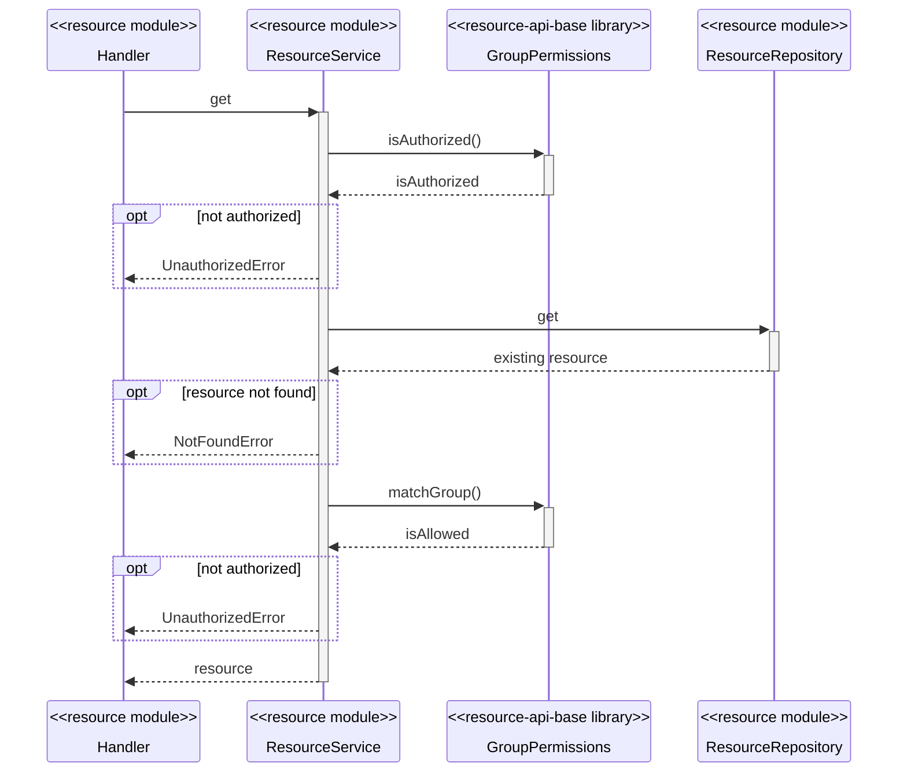
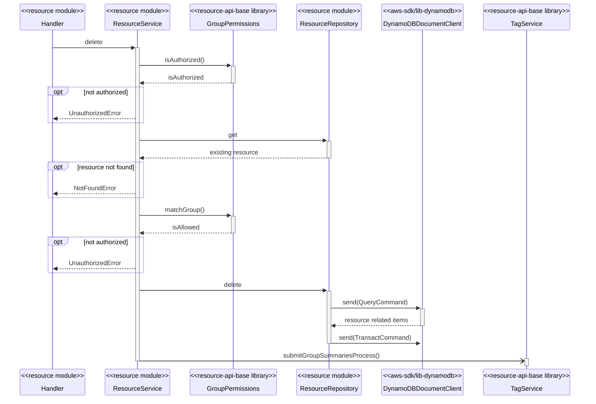
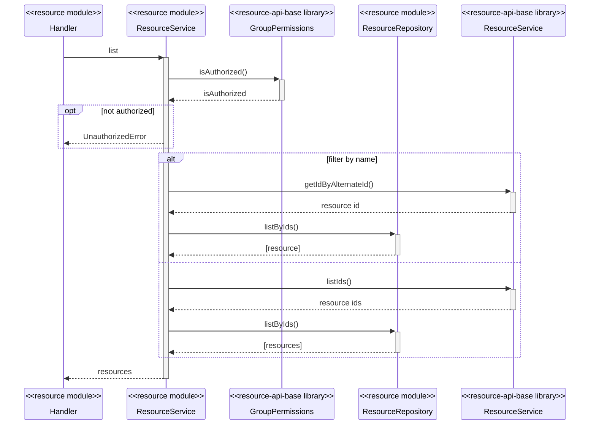
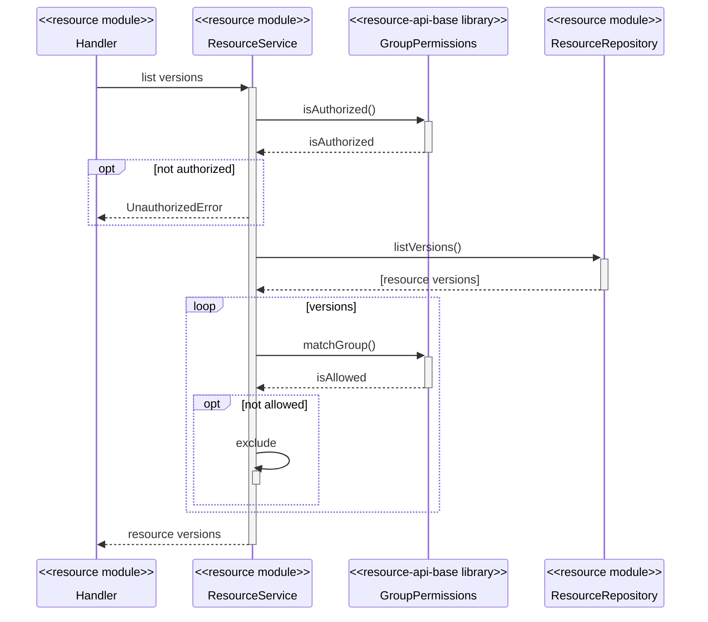
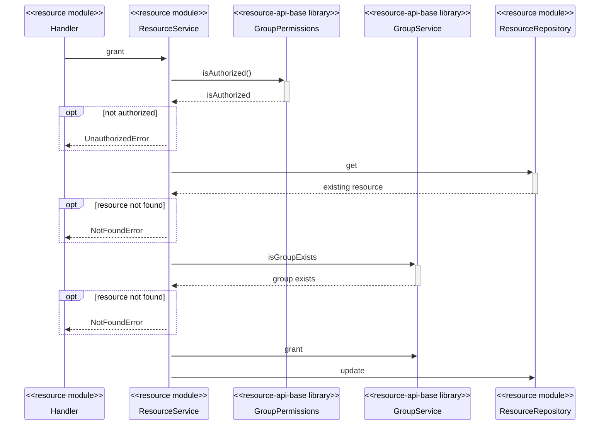
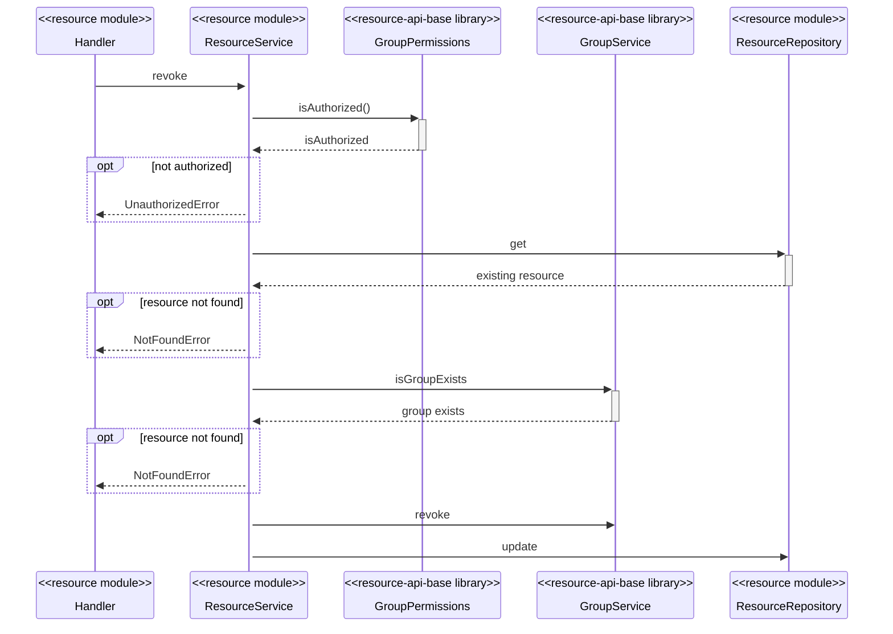

# resource-api-base library

## Introduction

This library acts as the base for all resource apis. It provides common authorization checks, tag, hierarchical group, config, and dependency injection functionality.

The library follows the pattern of exposing functionality at the service layer if it is isolated (e.g. asynchronously processing tag group summaries) bs exposing at the repository level if it is to be part of a wider transaction (e.g. providing the TransactWrites for creating tags to be part of a wider create resource transaction).

## Resource Data Access Assumptions

The library assumes the following data access assumptions are in place at the resource module level:

- Resource item:
  - Partition key `pk` - `<keyPrefix>:<id>`
  - Sort key `sk` - `<keyPrefix>`

## Process Flows

The following flows describe the basic patterns of how resource modules should be implemented using the library:

### Creating new resources

### Updating existing resources

### Get existing resource

### Delete existing resource

### List existing resource

### List resource versions

### Grant resource to group

### Revoke resource to group

## Steps for migrating existing modules to resource-api-base

Use the calculations module as a guide for the followig:

- DynamoDB utils refactor
  - Extract `PKType` into its own class
  - Replace `pkUtils.util.ts` and `dynamoDb.util.ts` with `@sif/dynamodb-utils`
- Implement library
  - Add `@sif/resource-api-base` dependency
  - Copy and repurpose the `calculations/groups/put.handler.ts` and `calculations/groups/delete.handler.ts` API endpoint handlers
  - Replace common schema, types, and responses, with base library
  - Wire up the provided `listTagsRoute` API endpoint handler from the library
  - Implement process flows as described above
  - Refactor config to merge with the library config
  - Refactor awilix to merge with the library awilix
- Integration tests
  - Copy and repurpose `calculations_groups.feature` and `calculations_tags.feature`
  - Ensure they pass
